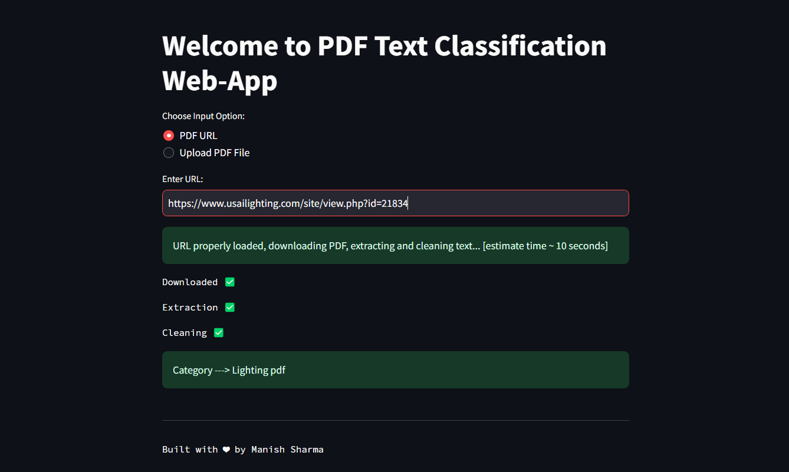
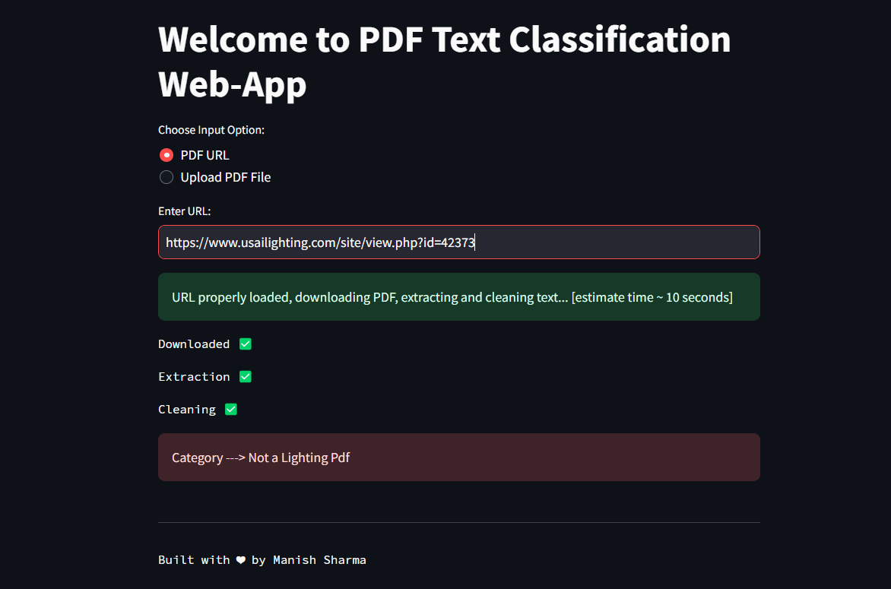
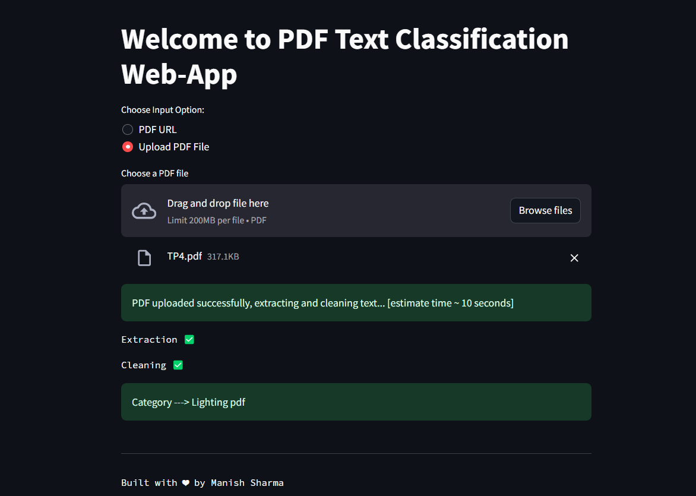
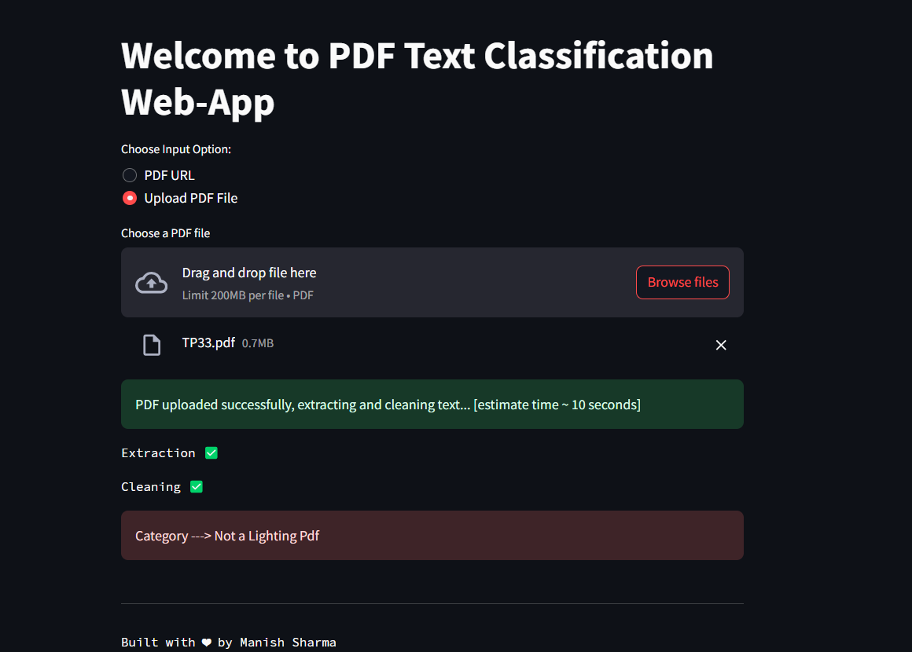

# parspec_assignment
This repo contains code and info for parspec assignment for DataScientist Role

Checkout the APP HERE -> https://parspec-bert-finetuned-lighting.streamlit.app/ 

----

# progress made 

- [x] : Download the pdf file from the URL and save them in directory [ ~ 1hrs ] - time taken to download, not for code [ start date - 30/11/23 ]
- [x] : Extract text from the pdf files and save them in a .txt file [ ~ 30 mins ] - time taken to extract text, not for code [ start date - 30/11/23 ]
- [x] : Convert the extracted text into a csv file [ for both train and test ]. This csv will be used for finetuning model
- [x] : Finetuned BERT base model and BERT large model, had issues in bert large model. Satisfied with bert base
- [x] : Try out Debertav3 model from MSFT for text classification  [ couldn't do it, since model is large and no compute power]
- [x] : Benchmarking the scores on test data [ Update : scored 91.25 % Accuracy ]
- [x] : Add a tutorial NB for the team to run the code and check preds
- [x] : Uploaded to huggingface hub [link -> https://huggingface.co/luci007/LightingData-Bert-Finetuned]
- [x] : Host on Streamlit Cloud [link -> https://parspec-bert-finetuned-lighting.streamlit.app/]

-----
# some snapshots from the WEB-APP

### [ inp - url , output - lighting pdf ]

### [ inp - url , output - no lighting pdf ]

### [ inp - pdf , output - lighting pdf ]

### [ inp - pdf , output - no lighting pdf ]

----

# improvements can be made 
### will talk in depth in interview and also in my documentation
- [ ] : Try out MultiModality Model [ Text + Images ] to be used for context [ time constraint, couldn't do]